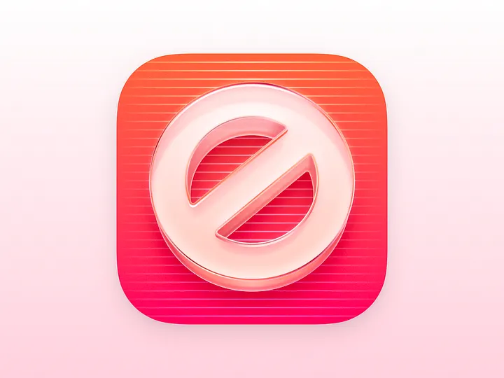
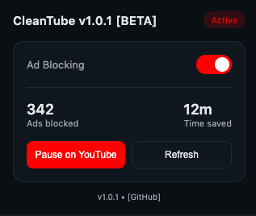

	<h1>CleanTube</h1>
	 

## 
A lightweight and efficient browser extension that blocks ads on YouTube, providing a clean and uninterrupted viewing experience. Built with performance and simplicity in mind, it removes video ads, banners, and pop-ups without slowing down playback.

## Usage

### 📥 Download Versions

| Version | Release Date | Download | Highlights | Status |
| :--- | :--- | :--- | :--- | :--- |
| **v1.0.1** | Apr 21, 2026 | <a href="dist/CleanTube_1.0.1.zip?raw=true" target="_blank">📦 CleanTube_1.0.1.zip</a> | Test | 🟢 BETA |

## Load the Extension
* Open Chrome and go to chrome://extensions/
* Enable “Developer mode” by toggling the switch.
* Click on “Load unpacked” and select the directory containing CleanTube extension zip file.

* **Open your Javascript console.** To do this, 
	* For Chrome Users :
		* Chrome : Press Option+Command+J
		* Safari : Press Option+Command+C
		* Firefox : Press Option+Command+K
	* For Firefox Users :
		* Chrome : Press Ctrl+Shift+J
		* Firefox : Press Ctrl+Shift+K

**Note: Do not restart the browser and then open the youtube page. Simply close the Console window.** 

**Voila** !! That's it.>!! now stream your favourite videos without cursing the ads.

## Issues
*  Debug Process continues...
* **CleanTube v1.0.1 [BETA] :** 
	* Added UI Interface
    * Updated AdBlock Script & Optimized alghoritm
    * [Icons, Tests, Debug] & first distribution file published soon - In Progress...
